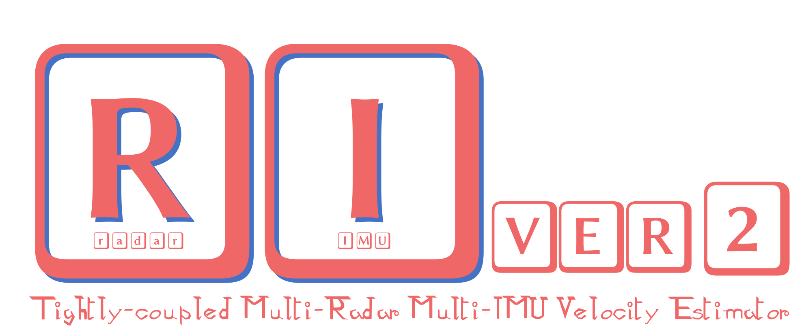
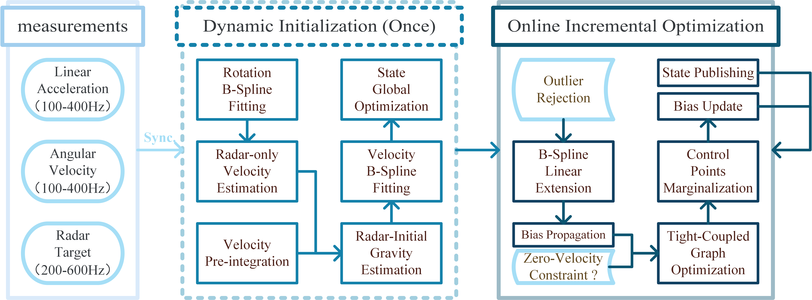

# River2: A Tightly-coupled Multi-Radar Mulit-IMU Velocity Estimator Based on Continuous-time Optimization




## 1. Overview

By utilizing a robust map-free estimation approach, River2 extends both the initialization state and batch estimation procedures to a multi-sensor framework. This allows for the continuous estimation of body-frame velocity by optimizing velocity and rotation B-splines, even in the event of a single sensor fault, significantly enhancing system robustness and resilience to interference. 



## 2. Build River2

### 2.1 Preparation

+ install `ROS1` (Ubuntu **20.04** is suggested):

  **Requirements: ROS1 & C++17 Support**

+ install `Ceres`:

  see the `GitHub` Profile of **[Ceres](https://github.com/ceres-solver/ceres-solver.git)** library, clone it, compile it, and install it. **Make sure that the version of `Ceres` contains the `Manifold` module. (`Ceres` version equal to 2.2.0 or higher than that)**

+ install `Sophus`:

  see the `GitHub` Profile of **[Sophus](https://github.com/strasdat/Sophus.git)** library, clone it, compile it, and install it.

+ install `magic-enum`:

  see the `GitHub` Profile of **[magic-enum](https://github.com/Neargye/magic_enum.git)** library, clone it, compile it, and install it.

+ install `Pangolin`:

  see the `GitHub` Profile of **[Pangolin](https://github.com/stevenlovegrove/Pangolin.git)** library, clone it, compile it, and install it.

+ install `spdlog`:

  see the `GitHub` Profile of **[spdlog](https://github.com/gabime/spdlog.git)** library, clone it, compile it, and install it.

+ install `fmt`, `Cereal`, `spdlog`, `yaml-cpp`:

  ```bash
  sudo apt-get install libfmt-dev
  sudo apt-get install libcereal-dev
  sudo apt-get install libyaml-cpp-dev
  ```
### 2.2 Clone River2

+ create a ros workspace if needed and clone `River2` to `src` directory as `river2`:

  ```bash
  mkdir -p ~/River2/src
  cd ~/River2/src
  
  git clone https://github.com/xtyang16/River2.git
  ```

+ Prepare for thirdparty ros packages:

  clone ros packages `ainstein_radar`, `ti_mmwave_rospkg`, `serial`, `sbg_ros_driver` to `src/..` (directory at the same level as `river2`):

  ```sh
  cd ~/River2/src
  git clone https://github.com/AinsteinAI/ainstein_radar.git
  git clone https://github.com/Unsigned-Long/ti_mmwave_rospkg.git
  git clone https://github.com/wjwwood/serial.git
  git clone https://github.com/SBG-Systems/sbg_ros_driver.git
  ```

### 2.3 Compile River2

+ Change directory to the ros workspace to build these packages:

   ```sh
  cd ~/River2
  catkin_make -j
  ```

  Note that these packages will depend on many other ros packages, you need to install them patiently.

### 2.4 Launch River2

**Attention**: to create a virtual reality (**VR**) perspective of the IMU (left window view in runtime), you have to change the model file path in configure field (`Preference::ObjFileForDispla`y) to `{root path}/river2/model/river.obj`. For a better VR perspective, you can design your own simulation scenario using `Blender` and export it as an `obj` file, then pass it to the configure file.

  ```sh
  roslaunch river2 river2-simu-multi.launch
  ```

### 3. Citation

If you use our paper for any academic work, please cite this paper.

```

```

### 4. Contact

If you have any questions, please contact:

+ Xiaoteng Yang (xtyang@whu.edu.cn)

### 5. Acknowledgement

Thanks for authors of [River](https://github.com/Unsigned-Long/River.git), [REVE](https://github.com/unizgfer-lamor/RAVE.git) and [rio](https://github.com/christopherdoer/rio.git).